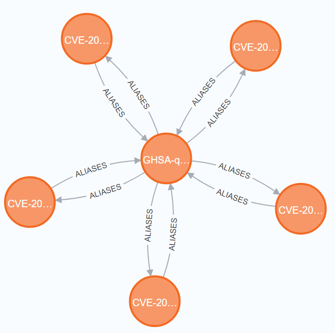
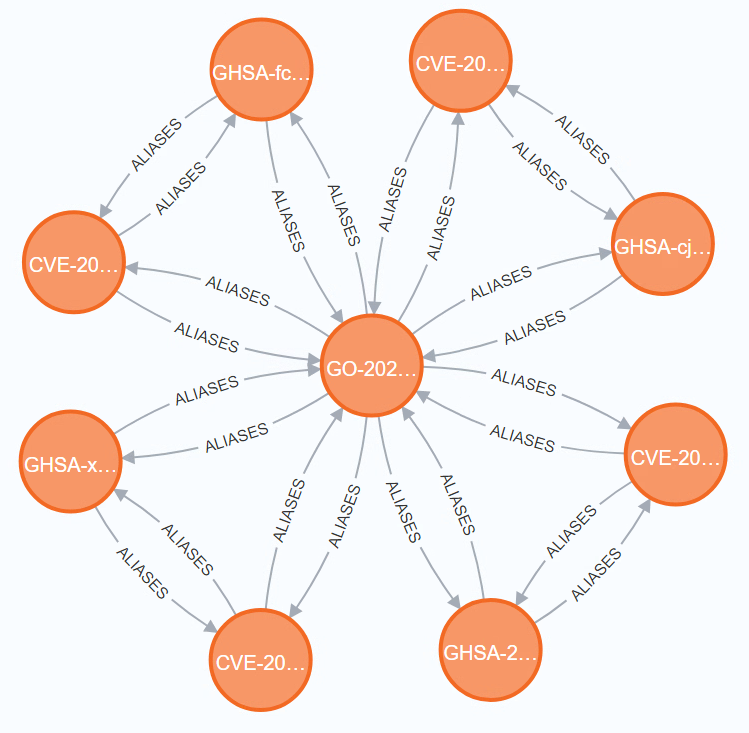
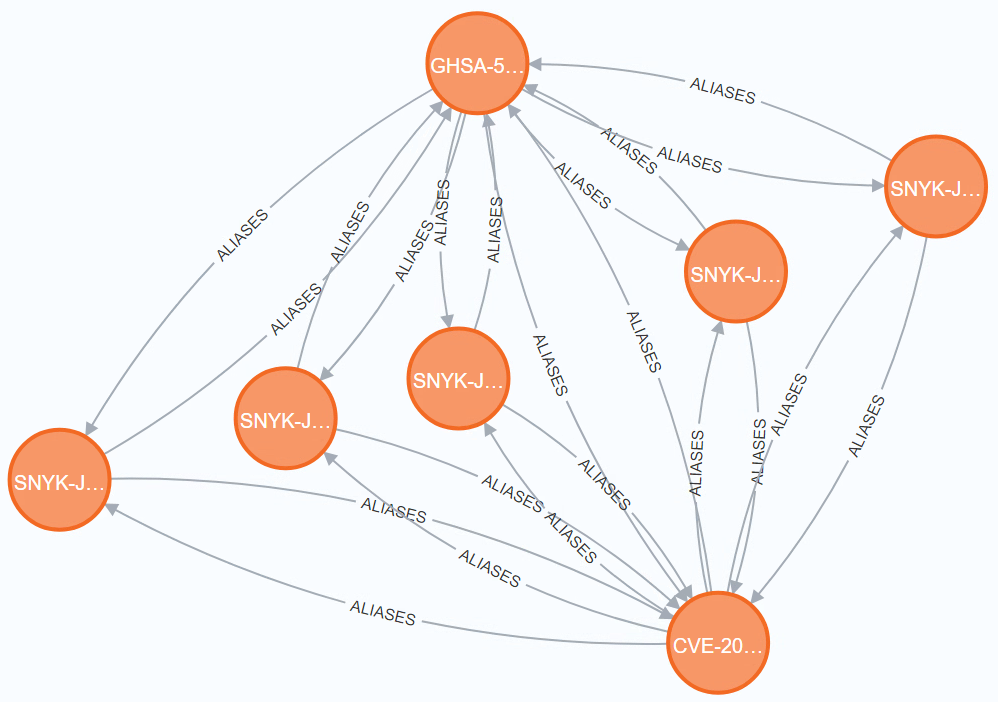

# Got Alias?

## Usage

```shell
docker compose up -d # Launch Neo4j
go run main.go \
  -db-user neo4j -db-pass j4oen \
  -osv \
  -ossindex -ossindex-user <USERNAME> -ossindex-token <TOKEN> \
  -snyk -snyk-orgid <ORG_ID> -snyk-token <TOKEN> \
  -purls purls.txt
```

> **Note**  
> Data from vulnerability databases that can not be mirrored has to be requested on
> a per-component basis. A list of PURLs can be provided for this purpose.
> To generate a PURL list from multiple CycloneDX BOMs in JSON format:
> ```shell
> for f in ./**/*.json; do jq -r '.components[].purl' $f >> purls.txt; done
> sort -u purls.txt > purls_unique.txt
> ```

> **Note**  
> Snyk API requests are rate limited, scanning many PURLs may take a long time.

### Useful Cypher Queries

```cypher
// Find a specific vulnerability by its ID
MATCH (:Vulnerability {id: "GHSA-5mcr-gq6c-3hq2"})
RETURN *

// Find all Snyk vulnerabilities and their aliases
MATCH (v:Vulnerability)-[:ALIASES]->(:Vulnerability)
WHERE v.id = STARTS WITH "SNYK-"
RETURN *

// Find all Snyk vulnerabilities that alias more than one CVE
MATCH (v:Vulnerability)-[r:ALIASES]->(a:Vulnerability)
WHERE v.id STARTS WITH "SNYK-"
    AND a.id STARTS WITH "CVE-"
WITH v, COUNT(r) AS rc
WHERE rc > 1
RETURN *
ORDER BY rc DESC
```

### Data Samples

#### [GHSA-qcvw-h34v-c7r9](https://github.com/pjsip/pjproject/security/advisories/GHSA-qcvw-h34v-c7r9)

Multiple CVEs have been registered for the same GHSA ID.

The official GitHub advisory only refers to `CVE-2021-43299`, but **4** more CVEs link back to the GHSA ID:

* `CVE-2021-43300`: *Stack overflow in PJSUA API when calling pjsua_recorder_create*
* `CVE-2021-43301`: *Stack overflow in PJSUA API when calling pjsua_playlist_create*
* `CVE-2021-43302`: *Read out-of-bounds in PJSUA API when calling pjsua_recorder_create*
* `CVE-2021-43303`: *Buffer overflow in PJSUA API when calling pjsua_call_dump*

OSV thus reports all those CVEs as aliases for `GHSA-qcvw-h34v-c7r9`.



Because `GHSA-qcvw-h34v-c7r9` aliases `CVE-2021-43299`, does it mean that it aliases the other 4 CVEs, too?
*Technically*, the other CVEs describe different things than `CVE-2021-43299`.

#### [GO-2022-0586](https://pkg.go.dev/vuln/GO-2022-0586)



#### [CVE-2021-21290](https://nvd.nist.gov/vuln/detail/CVE-2021-21290)

At the time of writing, Snyk has a total of [12 `SNYK-` vulnerabilities assigned](https://security.snyk.io/vuln/?search=CVE-2021-21290) to
`CVE-2021-21290` / `GHSA-5mcr-gq6c-3hq2`. It appears like Snyk created separate vulnerabilities
for each affected `netty` module. The vulnerabilities differ only in their *How to fix?* advice.



In this case, all vulnerabilities in the graph are indeed aliasing each other.
